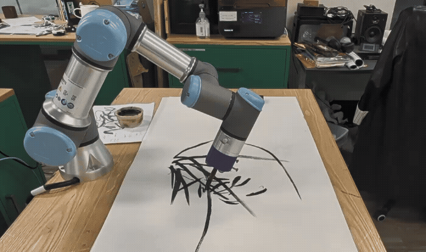

#  Blender to Universal Robots (UR) Live Sync Control Interface
  

  

    
    
    
    

An open-source framework for controlling **Universal Robot (UR3e)** directly from **Blender** in real-time.

This project was developed to explore the robotic reproduction of Traditional Chinese Ink Painting utilizing motion capture data. It features a Geometry Nodes-based control system that allows for parametric scaling, smoothing, and safety bounding.

---

## 📥 Download Project Files

The Python script and documentation are included in this repository. 

⚠️ **Note:** Due to GitHub file size limits, the full **Blender Project File (.blend)** containing the Motion Capture data and Geometry Nodes setup is hosted in the **Releases** section.

| File | Description | Location |
| :--- | :--- | :--- |
| **`ur_control_script.py`** | Main Python control script | [In Repository](./ur_control_script.py) |
| **`Instruction_Manual.pdf`** | Network setup guide | [In Repository](./Instruction_Manual.pdf) |
| **`UR_Ink_Painting_Demo.blend`** | **Full Project File (100MB+)** | **[Download from Releases](../../releases/latest)** |

> *To download the .blend file, click the link above, go to "Assets", and download the ZIP file.*

---

## ✨ Key Features

*   **⚡ Real-time Synchronization:** Low-latency control via TCP/IP Socket communication (Port 30003).
*   **🛡️ Safety Bounding Box:** Automatically returns the robot to a "Home Position" if the target object leaves the defined safety zone.
*   **🎨 Geometry Nodes Integration:** Process raw motion capture data (smoothing, retargeting) before sending it to the robot.
*   **🎛️ User-Friendly UI:** A custom Blender sidebar panel to control IP, Speed, and Smoothing without touching code.

---

### 🎥 Video Demonstration

Click the image below to watch the full performance on YouTube:

---

## 🚀 Quick Start

1.  **Hardware Prep:** Connect your UR Robot via Ethernet and set your computer's IP to static (e.g., `192.168.0.101`).
2.  **Download:** Get the `.blend` file from Releases and the script from this repo.
3.  **Open Blender:** Load `UR_Ink_Painting_Demo.blend`.
4.  **Load Script:** Go to the Scripting tab, open `ur_control_script.py`, and run it.
5.  **Control:** Press **N** in the 3D Viewport to open the sidebar, find the **UR Control** tab, and click **Start**.

> 📖 For detailed network configuration, please refer to the **[Instruction Manual (PDF)](Instruction_Manual.pdf)**.

---

## 🎓 Research Background

This tool was developed as part of a research project on **"Parametric Robotic Ink Painting"**.

*   **Technical Supervision:** Prof. Peter AC Nelson
*   **Artistic Data Source:** Prof. Koon (Traditional Chinese Ink Painting)
*   **Institution:** Hong Kong Baptist University

---

## 📄 License

This project is open-source. Feel free to use and modify for research and educational purposes.
